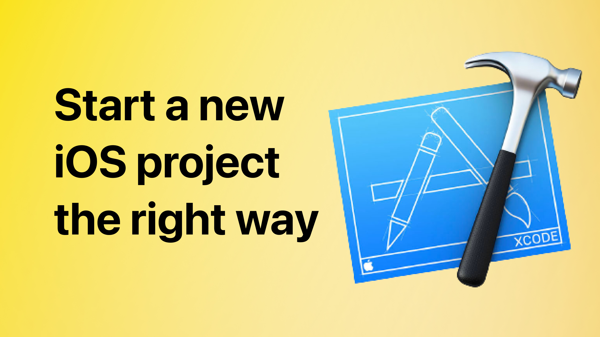

# The beginner's guide to setting up an iOS project

Here are the links from the YT video "The beginner's guide to setting up an iOS project" 🤗

## Links:
- [Link to the video](https://www.youtube.com/watch?v=DPQVPtQt2q4)
- [Planning your iOS app](https://developer.apple.com/ios/planning/)
- [Xcodes.app](https://github.com/RobotsAndPencils/XcodesApp)
- [.gitignore](https://gitignore.io/)
- [GitFlow](https://www.atlassian.com/git/tutorials/comparing-workflows/gitflow-workflow)
- [Install GitFlow](https://formulae.brew.sh/formula/git-flow)
- [GitHub](https://github.com/)
- [CocoaPods](https://cocoapods.org)
- [Carthage](https://github.com/Carthage/Carthage)
- [Lottie iOS](https://github.com/airbnb/lottie-ios)
- [Sentry](https://sentry.io/for/cocoa/)
- [Firebase](https://firebase.google.com/docs/crashlytics/get-started?platform=ios)
- [SwiftLint](https://github.com/realm/SwiftLint)
- [SwiftFormat](https://github.com/nicklockwood/SwiftFormat)
- [Pre-commit hook](https://medium.com/just-tech-it-now/swift-format-2c6786a15a4d)
- [Fake AppDelegate](https://samwize.com/2023/01/18/disconnect-your-app-from-unit-testing/)
- [SwiftGen](https://github.com/SwiftGen/SwiftGen)